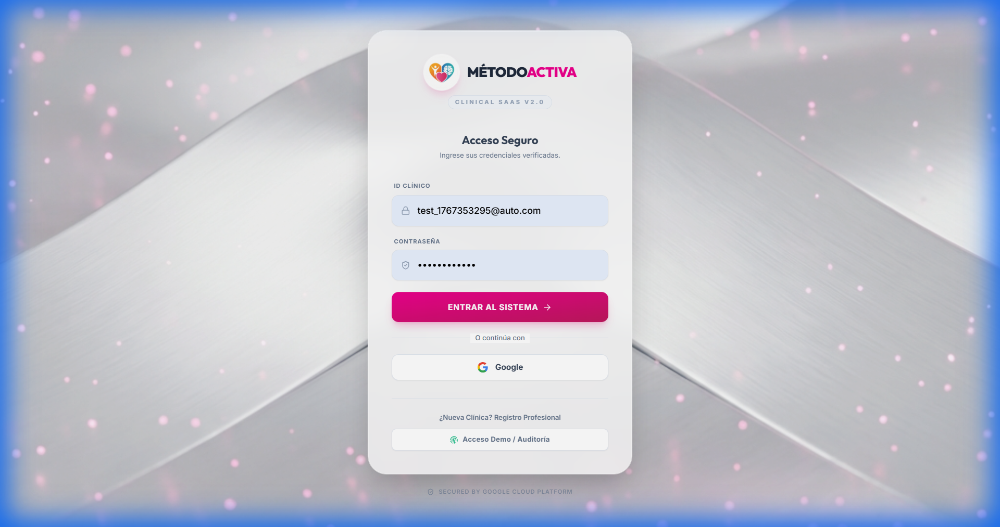

<div align="center">
  
  <h1>MÉTODO ACTIVA SAAS</h1>
  <p><strong>The Sovereign Clinical Operating System for Neuro-Cognitive Excellence.</strong></p>

  [](LICENSE)
  []()
  []()
</div>

<br />



---

## 🏥 The Vision
**Método Activa SaaS** is not just a CRM; it's a **comprehensive clinical ecosystem** designed for high-performance neuro-cognitive centers. Unlike generic solutions, this platform is engineered to handle complex patient tracking, group therapy dynamics, and precise invoice generation with **zero administrative friction**.

It is built on a **Sovereign Architecture**: You own the data, you own the infrastructure. No vendor lock-in.

## ✨ Key Features

| Feature | Description |
| :--- | :--- |
| **🧠 Deep Clinical Tracking** | Record detailed cognitive benchmarks, therapy progress, and patient history in a unified timeline. |
| **👥 Group Session Engine** | Manage multi-patient sessions effortlessly. ideal for group cognitive workshops. |
| **💳 Smart Billing** | Automated invoicing system linked directly to session attendance. One-click export to PDF. |
| **🔐 HIPAA-Ready Security** | Built on Google Identity Platform. End-to-end encryption for sensitive medical data. |
| **⚡ "Metallic Light" UI** | A premium, distraction-free interface designed for clinicians who spend 8+ hours a day on screen. |

---

## 🏗️ Enterprise Architecture

Built for **Infinite Scalability** using Google Cloud Serverless technology.

```mermaid
graph TD
    User[Clients / Doctors] -->|SSL Encrypted| CDN[Firebase Global Edge]
    CDN -->|Powering| SPA[React High-Performance Client]
    
    subgraph "Secure Cloud Core (GCP)"
        SPA -->|Auth (JWT)| ID[Identity Platform]
        SPA -->|Live Data| Firestore[NoSQL Document Store]
        SPA -->|Business Logic| API[Cloud Run Serverless API]
        
        API -->|Admin Access| Firestore
        API -->|Storage| Buckets[Private Cloud Storage]
    end
```

---

## 🚀 Technical Quick Start

Ready to deploy your own instance?

### Prerequisites
- Node.js v20+
- Google Cloud CLI

### 1. Installation
```bash
# Install dependencies
pnpm install

# Start Local Clinical Environment
pnpm run dev
```

### 2. Production Deployment
```bash
# Compile optimized artifacts
pnpm run build

# Deploy to Global CDN
firebase deploy
```

---

## 🔒 License & Rights
**Copyright © 2026 Método Activa SaaS.** All Rights Reserved.
This software is **Proprietary**. Unauthorised copying, modification, distribution, or use is strictly prohibited.

> *Empowering Clinicians. Restoring Minds.*
