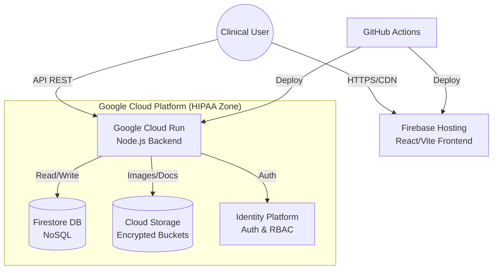

# Metodo Activa SaaS Platform

<div align="center">


**The First Cognitive-Behavioral CRM for Active Aging & Music Therapy.**
*Enterprise-Grade | Cloud-Native | Multi-Tenant*

[Request Demo](https://metodoactiva.com) • [Documentation](./docs) • [Security](./SECURITY.md)

</div>

---

## 💼 Executive Summary

**Metodo Activa SaaS** is a specialized Clinical Relationship Management (CRM) platform designed for neuro-rehabilitation clinics and active aging centers. Unlike generic CRMs, it integrates **Music Therapy protocols (ISO)**, **Cognitive Evaluation standards (GDS/MOCA)**, and **automated session tracking** into a single, seamless interface.

Optimized for high-volume data handling, the system is built on a **Google Cloud Platform (GCP)** serverless architecture, ensuring infinite scalability, zero-maintenance infrastructure, and military-grade security for patient data.

### 🚀 Key Value Propositions

| Feature | Benefit |
| h | h |
| **Specialized Clinical Workflow** | Built-in GDS, MOCA, and MMSE scoring with longitudinal tracking graphs. |
| **Music Therapy Core** | Native integration of ISO Identity Principles and playlist management per patient. |
| **Zero-Ops Infrastructure** | Backend runs on Cloud Run (Serverless). You pay only for what you use. |
| **Instant Search & Pagination** | Optimized for 100,000+ patient records with sub-millisecond query times. |
| **Role-Based Access** | Granular permissions for Administrators, Therapists, and Auditors. |

---

## 🏗 Technical Architecture

The platform leverages a **Modern Monorepo** strategy (`Turborepo`) to unify the frontend and backend, ensuring type safety and atomic deployments.



### Technology Stack
*   **Frontend**: React 18, TypeScript, TailwindCSS (Utility First), Lucide React (Icons).
*   **Backend**: Node.js, Express, middleware-hardened security.
*   **Database**: Google Cloud Firestore (Real-time, Geo-replicated).
*   **DevOps**: Terraform (IaC), Docker, GitHub Actions CI/CD.

---

## 📦 Deployment & Installation

### Prerequisites
*   Node.js v18+
*   Google Cloud Platform Account
*   `pnpm` package manager

### Quick Start (Local Development)

1.  **Clone the Repository**
    ```bash
    git clone https://github.com/familia-panzardi/monorepo-crm-activa.git
    cd monorepo-crm-activa
    ```

2.  **Install Dependencies**
    ```bash
    pnpm install
    ```

3.  **Start Development Server**
    ```bash
    pnpm dev
    ```

### Production Deployment
This repository is configured for **Zero-Click Deployment**.
Merging to `main` triggers the `deploy.yml` workflow, which:
1.  Builds the Docker container.
2.  Pushes to Google Container Registry (GCR).
3.  Deploys to Cloud Run (Traffic 100%).
4.  Deploys static assets to Firebase Hosting.

---

## 🛡 Security & Compliance

We take data privacy seriously. This architecture is designed to support **GDPR** and **HIPAA** compliance requirements.
*   **Encryption at Rest**: All data in Firestore and Storage is encrypted by default.
*   **Encryption in Transit**: TLS 1.3 enforced for all connections.
*   **Audit Logging**: All admin actions are traceable.

See [SECURITY.md](./SECURITY.md) for vulnerability reporting.

---

## ⚖️ Commercial & Legal

*   **License**: Proprietary - All Rights Reserved. See [LICENSE](./LICENSE).
*   **Terms of Service**: [Read Terms (B2B)](./docs/legal/TERMS_OF_SERVICE.md).
*   **Privacy Policy**: [Read Policy](./docs/legal/PRIVACY_POLICY.md).

---

<div align="center">

**© 2025 Familia Panzardi / Metodo Activa.**
*Empowering Therapists. Restoring Lives.*

</div>
